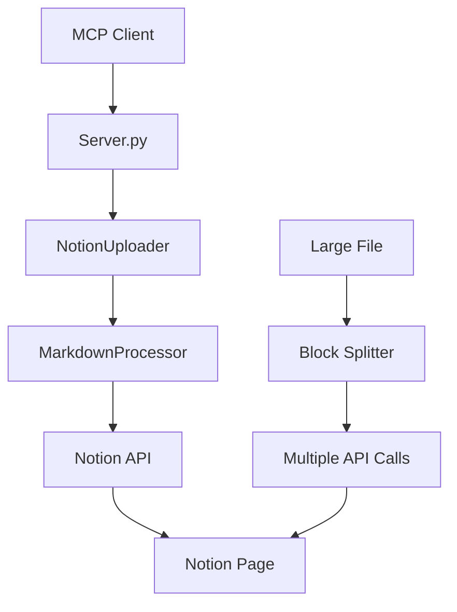

# Markdown2Notion Architecture Design# Markdown2Notion MCP Server 設計書


## Overview## 1. 要件定義


Markdown2Notion is a Model Context Protocol (MCP) server that enables seamless conversion of Markdown files into Notion pages. The application is designed with modularity and extensibility in mind, making it easy to integrate with various MCP clients like Claude Desktop, Cline, and other MCP-compatible tools.### 1.1 基本情報

- ソフトウェア名称: Markdown2Notion MCP Server

## What is Model Context Protocol (MCP)?- 目的: MarkdownファイルをNotionページとして効率的にアップロード


Model Context Protocol (MCP) is an open standard for connecting AI assistants to various tools and data sources. It allows AI models to:### 1.2 プロジェクト概要

CLINEなどのAIコーディングツールから、MarkdownファイルをNotionに直接アップロードできるMCPサーバーを提供します。

- **Execute Tools**: Perform actions like file operations, API calls, or data processing

- **Access Resources**: Read files, query databases, or fetch web content  ### 1.3 機能要件

- **Maintain Context**: Keep track of ongoing conversations and state

#### 1.3.1 主要機能

### MCP Benefits for Users- MarkdownファイルをNotionページとして作成

- データベースまたは親ページを指定可能

- **Seamless Integration**: Connect AI assistants to your existing tools- **ファイル名をページタイトルとして自動使用**（拡張子は除去）

- **Secure**: Tools run locally with your permissions- リッチテキスト、見出し、リスト、コードブロックに対応

- **Extensible**: Easy to add new capabilities

- **Standard Protocol**: Works across different AI clients#### 1.3.2 MCPインターフェース

- `upload_markdown`: Markdownファイルアップロード

## Core Components- `list_pages`: Notionページ一覧取得（デバッグ用）


### 1. MCP Server (`server.py`)### 1.4 技術要件

The FastMCP-based server that exposes tools for Notion integration.- Python 3.10以上

- FastMCPライブラリを使用

**Key Features:**- Notion API v1を使用

- **Tool Registration**: Defines available functions for MCP clients- 環境変数での設定管理

- **Error Handling**: Comprehensive error management and user-friendly responses

- **Environment Management**: Secure handling of API credentials## 2. システム設計

- **URL Processing**: Converts Notion URLs to page IDs automatically

### 2.1 アーキテクチャ

**Available Tools:**```

```python[CLINE] <--MCP--> [Markdown2Notion Server] <--API--> [Notion]

@mcp.tool()                           |

def upload_markdown(filepath, parent_url=None, database_id=None, parent_page_id=None)                  [Markdownファイル]

# Upload Markdown files to Notion with automatic block splitting```


@mcp.tool() ### 2.2 クラス設計

def upload_markdown_content(content, title, parent_url=None, ...)

# Upload raw Markdown content directly#### MarkdownProcessor

- Markdownのパースと構造化

@mcp.tool()- Notionブロック形式への変換

def list_database_pages(database_id, limit=10)- **ファイル名からページタイトル抽出**

# List pages in a database for reference

#### NotionUploader

@mcp.tool()- Notion APIとの通信

def get_database_info(database_id)- ページ作成処理

# Get database information

```### 2.3 エラーハンドリング

- ファイル存在チェック

### 2. Notion Uploader (`notion_uploader.py`)- API認証エラー処理

Core client for Notion API interactions with advanced features.- 適切なエラーメッセージ返却


**Key Responsibilities:**## 3. 実装詳細

- **API Authentication**: Secure Notion API client management

- **Smart Page Creation**: Handles both database and page targets### 3.1 ファイル名処理

- **Block Splitting**: Automatically handles 100+ block limitation- Markdownファイルのファイル名（拡張子除く）をページタイトルとして使用

- **URL Parsing**: Extracts page IDs from Notion URLs- 例: `sample.md` → ページタイトル: `sample`

- **Error Recovery**: Robust error handling for API constraints- 例: `project-overview.md` → ページタイトル: `project-overview`


**New Features:**### 3.2 H1タグの扱い

```python- H1タグはコンテンツの一部として処理

def _create_page_with_blocks(self, blocks, title, ...)- ページタイトルには影響しない
# Automatically splits large files into manageable chunks

def extract_page_id_from_url(url)
# Converts https://notion.so/page-abc123... to proper page ID
```

### 3. Markdown Processor (`markdown_processor.py`)
Converts Markdown syntax into Notion block structures with high fidelity.

**Supported Elements:**
- **Headers** (H1-H6) → Notion heading blocks
- **Paragraphs** with rich text formatting (bold, italic, inline code)
- **Lists** (bulleted and numbered) → Notion list blocks  
- **Code Blocks** with language syntax highlighting
- **Links** → Notion link formatting
- **Mixed Content** → Complex nested structures

**Processing Pipeline:**
```python
Markdown Text → Mistune Parser → Notion Block Objects → API Payload
```

## Data Flow Architecture



### Detailed Flow

1. **MCP Request**: Client sends tool request with file path and target
2. **URL Processing**: Server extracts page ID from Notion URL if provided
3. **File Reading**: Markdown file is loaded and validated
4. **Block Conversion**: Markdown elements converted to Notion blocks
5. **Smart Upload**: 
   - Files ≤100 blocks: Single API call
   - Files >100 blocks: Initial page + chunked appends
6. **Response**: Page URL and success confirmation

## Advanced Features

### Automatic Block Splitting
```python
# Handles Notion's 100-block limit transparently
if len(blocks) <= 100:
    # Single page creation
    page = client.pages.create(parent=parent, properties=properties, children=blocks)
else:
    # Create initial page with first 100 blocks
    page = client.pages.create(parent=parent, properties=properties, children=blocks[:100])
    
    # Append remaining blocks in chunks
    for chunk in chunked_blocks(blocks[100:], 100):
        client.blocks.children.append(block_id=page_id, children=chunk)
```

### URL-Based Targeting
```python
# User provides simple URL instead of complex page ID
parent_url = "https://www.notion.so/My-Project-16132a3709e4816cb512e4d73d345003"
page_id = extract_page_id_from_url(parent_url)
# Returns: "16132a37-09e4-816c-b512-e4d73d345003"
```

## Error Handling Strategy

### Comprehensive Error Management
- **File System**: Missing files, permissions, encoding issues
- **Notion API**: Authentication, rate limits, invalid IDs, network errors
- **Markdown Processing**: Malformed content, unsupported syntax
- **MCP Protocol**: Tool execution, parameter validation
- **Block Limits**: Automatic handling of size constraints

### User-Friendly Responses
```python
# Instead of raw API errors, users get helpful messages:
"Successfully uploaded 'document.md' to Notion.
Page ID: 29832a37-09e4-8169-afbb-e81a5dfcd12a
View at: https://www.notion.so/29832a3709e48169afbbe81a5dfcd12a"
```

## Configuration & Setup

### Environment Management
```bash
# Simple .env file approach
NOTION_TOKEN=secret_xxxxx...

# MCP settings (no token duplication needed)
{
  "mcpServers": {
    "markdown2notion": {
      "command": "python",
      "args": ["/path/to/server.py"]
    }
  }
}
```

### Security Best Practices
- **Token Management**: Environment variables, no hardcoding
- **Access Control**: Notion integration permissions
- **Input Validation**: File path sanitization
- **Error Sanitization**: No sensitive data in error messages

## Extensibility & Future Enhancements

### Planned Features
- **Batch Operations**: Upload multiple files at once
- **Template Support**: Predefined page structures
- **Media Support**: Images, attachments, embeds
- **Advanced Formatting**: Tables, callouts, toggles
- **Sync Capabilities**: Bidirectional Markdown ↔ Notion sync

### Plugin Architecture
The modular design allows easy extension:
```python
# New processors can be added
class AdvancedMarkdownProcessor(MarkdownProcessor):
    def process_tables(self, table_element):
        # Convert Markdown tables to Notion database blocks
        pass
```

## Performance Characteristics

### Optimization Features
- **Memory Efficient**: Stream processing for large files
- **Rate Limit Aware**: Intelligent API call spacing
- **Concurrent Safe**: Stateless design for multiple requests
- **Chunk Processing**: Optimal block size management
- **Error Recovery**: Automatic retry with exponential backoff

### Scalability Considerations
- **File Size**: No practical limit due to automatic splitting
- **Concurrent Users**: Stateless design supports multiple clients
- **API Quotas**: Respects Notion rate limits and quotas

## Testing & Quality Assurance

### Testing Strategy
- **Unit Tests**: Individual component validation
- **Integration Tests**: End-to-end workflow verification
- **Error Scenario Tests**: Comprehensive failure mode testing
- **Performance Tests**: Large file and concurrent user testing
- **MCP Protocol Tests**: Client compatibility verification

### Quality Metrics
- **Reliability**: Handles edge cases gracefully
- **Usability**: Simple URL-based interface
- **Maintainability**: Clear separation of concerns
- **Documentation**: Comprehensive guides and examples

## Deployment & Distribution

### GitHub Repository Structure
```
markdown2notion/
├── src/                  # Core application code
├── docs/                # Architecture and API documentation
├── examples/            # Sample files and usage demos
├── tests/              # Comprehensive test suite
├── .env.example        # Environment template
├── .gitignore         # Git ignore patterns
├── LICENSE            # Open source license
├── pyproject.toml     # Python project configuration
└── README.md          # User documentation
```

This architecture ensures Markdown2Notion is not just a working tool, but a robust, extensible, and user-friendly solution for Markdown-to-Notion workflows.