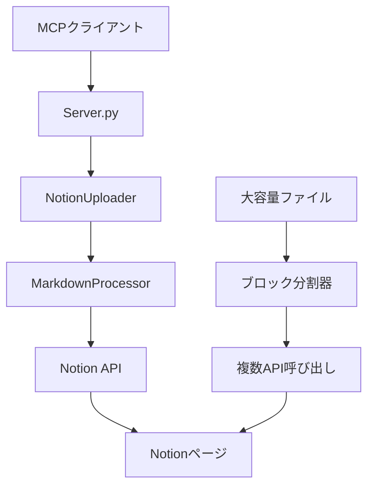

# Markdown2Notion アーキテクチャ設計書

## 概要

Markdown2Notionは、MarkdownファイルをNotionページにシームレスに変換するModel Context Protocol (MCP)サーバーです。モジュラリティと拡張性を重視した設計で、Claude Desktop、Cline、その他のMCP対応ツールなど、様々なMCPクライアントとの統合を容易にします。

## Model Context Protocol (MCP)とは？

Model Context Protocol (MCP)は、AIアシスタントを様々なツールやデータソースに接続するためのオープンスタンダードです。AIモデルが以下を可能にします：

- **ツールの実行**: ファイル操作、API呼び出し、データ処理などのアクションを実行
- **リソースへのアクセス**: ファイルの読み取り、データベースへのクエリ、ウェブコンテンツの取得
- **コンテキストの維持**: 継続的な会話と状態の追跡

### ユーザーにとってのMCPの利点

- **シームレスな統合**: AIアシスタントを既存のツールに接続
- **セキュア**: ツールはユーザーの権限でローカルに実行
- **拡張可能**: 新しい機能を簡単に追加
- **標準プロトコル**: 異なるAIクライアント間で動作

## コアコンポーネント

### 1. MCPサーバー (`server.py`)
Notionとの統合のためのツールを公開するFastMCPベースのサーバー。

**主要機能:**
- **ツール登録**: MCPクライアント向けに利用可能な関数を定義
- **エラーハンドリング**: 包括的なエラー管理とユーザーフレンドリーなレスポンス
- **環境管理**: API認証情報の安全な処理
- **URL処理**: NotionのURLを自動的にページIDに変換

**利用可能なツール:**
```python
@mcp.tool()
def upload_markdown(filepath, parent_url=None, database_id=None, parent_page_id=None)
# 自動ブロック分割機能付きのMarkdownファイルアップロード

@mcp.tool() 
def upload_markdown_content(content, title, parent_url=None, ...)
# 生のMarkdownコンテンツを直接アップロード

@mcp.tool()
def list_database_pages(database_id, limit=10)
# 参照用のデータベースページ一覧

@mcp.tool()
def get_database_info(database_id)
# データベース情報取得
```

### 2. Notion Uploader (`notion_uploader.py`)
高度な機能を持つNotion API相互作用のためのコアクライアント。

**主要責任:**
- **API認証**: 安全なNotion APIクライアント管理
- **スマートページ作成**: データベースとページの両方のターゲットに対応
- **ブロック分割**: 100ブロック以上の制限を自動処理
- **URL解析**: NotionのURLからページIDを抽出
- **エラー回復**: API制約に対する堅牢なエラー処理

**新機能:**
```python
def _create_page_with_blocks(self, blocks, title, ...)
# 大容量ファイルを管理可能なチャンクに自動分割

def extract_page_id_from_url(url)
# https://notion.so/page-abc123... を適切なページIDに変換
```

### 3. Markdown Processor (`markdown_processor.py`)
高い忠実度でMarkdown構文をNotionブロック構造に変換。

**サポートされる要素:**
- **ヘッダー** (H1-H6) → Notionヘッディングブロック
- **段落** リッチテキスト書式（太字、斜体、インラインコード）付き → Notion段落ブロック
- **リスト**（箇条書き・番号付き）→ Notionリストブロック
- **コードブロック** 言語シンタックスハイライト付き
- **リンク** → Notionリンク書式
- **混合コンテンツ** → 複雑なネストした構造

**処理パイプライン:**
```python
Markdownテキスト → Mistuneパーサー → Notionブロックオブジェクト → APIペイロード
```

## データフロー アーキテクチャ



### 詳細フロー

1. **MCPリクエスト**: クライアントがファイルパスとターゲットでツールリクエストを送信
2. **URL処理**: サーバーが提供されたNotion URLからページIDを抽出
3. **ファイル読み取り**: Markdownファイルの読み込みと検証
4. **ブロック変換**: Markdown要素をNotionブロックに変換
5. **スマートアップロード**: 
   - ファイル ≤100ブロック: 単一API呼び出し
   - ファイル >100ブロック: 初期ページ + チャンク追加
6. **レスポンス**: ページURLと成功確認

## 高度な機能

### 自動ブロック分割
```python
# Notionの100ブロック制限を透明に処理
if len(blocks) <= 100:
    # 単一ページ作成
    page = client.pages.create(parent=parent, properties=properties, children=blocks)
else:
    # 最初の100ブロックで初期ページを作成
    page = client.pages.create(parent=parent, properties=properties, children=blocks[:100])
    
    # 残りのブロックをチャンクで追加
    for chunk in chunked_blocks(blocks[100:], 100):
        client.blocks.children.append(block_id=page_id, children=chunk)
```

### URLベースのターゲット指定
```python
# ユーザーは複雑なページIDの代わりに簡単なURLを提供
parent_url = "https://www.notion.so/My-Project-16132a3709e4816cb512e4d73d345003"
page_id = extract_page_id_from_url(parent_url)
# 戻り値: "16132a37-09e4-816c-b512-e4d73d345003"
```

## エラーハンドリング戦略

### 包括的エラー管理
- **ファイルシステム**: ファイルの不在、権限、エンコーディング問題
- **Notion API**: 認証、レート制限、無効なID、ネットワークエラー
- **Markdown処理**: 不正なコンテンツ、サポートされていない構文
- **MCPプロトコル**: ツール実行、パラメータ検証
- **ブロック制限**: サイズ制約の自動処理

### ユーザーフレンドリーなレスポンス
```python
# 生のAPIエラーの代わりに、ユーザーに役立つメッセージを提供:
"'document.md' を Notion に正常にアップロードしました。
ページID: 29832a37-09e4-8169-afbb-e81a5dfcd12a
表示: https://www.notion.so/29832a3709e48169afbbe81a5dfcd12a"
```

## 設定とセットアップ

### 環境管理
```bash
# シンプルな .env ファイルアプローチ
NOTION_TOKEN=secret_xxxxx...

# MCP設定（トークンの重複不要）
{
  "mcpServers": {
    "markdown2notion": {
      "command": "python",
      "args": ["/path/to/server.py"]
    }
  }
}
```

### セキュリティベストプラクティス
- **トークン管理**: 環境変数、ハードコーディング禁止
- **アクセス制御**: Notionインテグレーション権限
- **入力検証**: ファイルパスのサニタイゼーション
- **エラーサニタイゼーション**: エラーメッセージに機密データを含めない

## 拡張性と将来の改良

### 計画されている機能
- **バッチ操作**: 複数ファイルの一括アップロード
- **テンプレートサポート**: 事前定義されたページ構造
- **メディアサポート**: 画像、添付ファイル、埋め込み
- **高度な書式設定**: テーブル、コールアウト、トグル
- **同期機能**: Markdown ↔ Notion 双方向同期

### プラグインアーキテクチャ
モジュラー設計により簡単な拡張が可能:
```python
# 新しいプロセッサーを追加可能
class AdvancedMarkdownProcessor(MarkdownProcessor):
    def process_tables(self, table_element):
        # MarkdownテーブルをNotionデータベースブロックに変換
        pass
```

## パフォーマンス特性

### 最適化機能
- **メモリ効率**: 大容量ファイルのストリーム処理
- **レート制限対応**: インテリジェントなAPI呼び出し間隔
- **並行安全**: 複数リクエストのステートレス設計
- **チャンク処理**: 最適なブロックサイズ管理
- **エラー回復**: 指数バックオフによる自動リトライ

### スケーラビリティの考慮事項
- **ファイルサイズ**: 自動分割により実用的な制限なし
- **並行ユーザー**: ステートレス設計で複数クライアントをサポート
- **APIクォータ**: Notionのレート制限とクォータを尊重

## テスト・品質保証

### テスト戦略
- **ユニットテスト**: 個別コンポーネントの検証
- **統合テスト**: エンドツーエンドワークフローの検証
- **エラーシナリオテスト**: 包括的な失敗モードテスト
- **パフォーマンステスト**: 大容量ファイルと並行ユーザーのテスト
- **MCPプロトコルテスト**: クライアント互換性の検証

### 品質メトリクス
- **信頼性**: エッジケースを適切に処理
- **ユーザビリティ**: シンプルなURLベースインターフェース
- **保守性**: 関心の明確な分離
- **ドキュメント**: 包括的なガイドと例

## デプロイメントと配布

### GitHubリポジトリ構造
```
markdown2notion/
├── src/                  # コアアプリケーションコード
├── docs/                # アーキテクチャとAPIドキュメント
├── examples/            # サンプルファイルと使用例
├── tests/              # 包括的なテストスイート
├── .env.example        # 環境変数テンプレート
├── .gitignore         # Git除外パターン
├── LICENSE            # オープンソースライセンス
├── pyproject.toml     # Pythonプロジェクト設定
└── README.md          # ユーザードキュメント
```

このアーキテクチャにより、Markdown2Notionは単なる動作するツールではなく、Markdown-to-Notionワークフローのための堅牢で拡張可能、かつユーザーフレンドリーなソリューションとなることを保証しています。